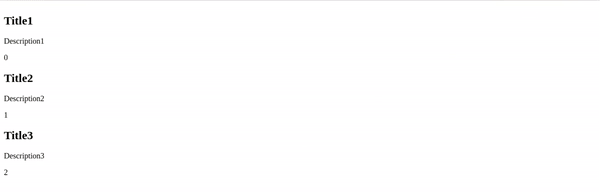

# vue-swipe-actions component

> A VueJS component to create iOS styled swipe actions.

## Table of contents

- [Browser Support](#browser-support)
- [Demo](#demo)
- [Getting started](#getting-started)
- [Import styles](#import-styles)
- [Usage](#usage)
- [SwipeList](#swipeList)
- [Available Props](#available-props)
- [Events](#events)
- [Methods](#methods)
- [SwipeOut](#swipeout)
- [Want to Contribute?](#want-to-contribute)
- [Need Help / Support?](#need-help)
- [Collection of Other Components](#collection-of-components)
- [Changelog](#changelog)
- [Credits](#credits)
- [License](#license)
- [Keywords](#Keywords)

## Browser Support

 |  |  |  |  |
--- | --- | --- | --- | --- |
83.0 ✔ | 77.0  ✔ | 13.1.1 ✔ | 83.0 ✔ | 11.9 ✔ |

## Demo

[](https://github.com/weblineindia/Vue-Swipe-Action/swipe.gif)

## Getting started

```
npm install --save vue-weblineindia-swipe
```

```js
import { SwipeList, SwipeOut } from 'vue-weblineindia-swipe';

export default {
  components: {
    SwipeOut,
    SwipeList
  }
};
```

### Import Styles

```javascript
import 'vue-weblineindia-swipe/dist/vue-swipe-actions.css';
```

## Usage

```html
<swipe-list
	ref="list"
	class="card"
	:disabled="!enabled"
	:items="mockSwipeList"
	item-key="id"
	@swipeout:click="itemClick"
>
	<template v-slot="{ item, index, revealLeft, revealRight, close }">
		<!-- item is the corresponding object from the array -->
		<!-- index is clearly the index -->
		<!-- revealLeft is method which toggles the left side -->
		<!-- revealRight is method which toggles the right side -->
		<!-- close is method which closes an opened side -->
		<div class="card-content">
			<!-- style content how ever you like -->
			<h2>{{ item.title }}</h2>
			<p>{{ item.description }}</p>
			<span>{{ index }}</span>
		</div>
	</template>
	<!-- left swipe side template and v-slot:left="{ item }" is the item clearly -->
	<!-- remove if you dont wanna have left swipe side  -->
	<template v-slot:left="{ item, close }">
		<div class="swipeout-action red" title="remove" @click="remove(item)">
			<!-- place icon here or what ever you want -->
			<i class="fa fa-trash"></i>
		</div>
		<div class="swipeout-action purple" @click="close">
			<!-- place icon here or what ever you want -->
			<i class="fa fa-close"></i>
		</div>
	</template>
	<!-- right swipe side template and v-slot:right"{ item }" is the item clearly -->
	<!-- remove if you dont wanna have right swipe side  -->
	<template v-slot:right="{ item }">
		<div class="swipeout-action blue">
			<!-- place icon here or what ever you want -->
			<i class="fa fa-edit"></i>
		</div>
	
	</template>
	<template v-slot:empty>
		<div>
			<!-- change mockSwipeList to an empty array to see this slot in action  -->
			list is empty ( filtered or just empty )
		</div>
	</template>
</swipe-list>
```

```js
export default {
  components: {
    SwipeOut,
    SwipeList
  },
  data() {
    return {
      enabled: true,
      mockSwipeList: [
          {
            id: 0,
            title: "Title1",
            description: "Description1",
            value: "value1"
          },
          {
            id: 1,
            title: "Title2",
            description: "Description2",
            value: "value2"
          },
          {
            id: 3,
            title: "Title3",
            description: "Description3",
            value: "value3"
          }
      ]
    };
  },
  methods: {
    revealFirstRight() {
      this.$refs.list.revealRight(0);
    },
    revealFirstLeft() {
      this.$refs.list.revealLeft(0);
    },
    closeFirst() {
      this.$refs.list.closeActions(0);
    },
    closeAll() {
      this.$refs.list.closeActions();
    },
    remove(item) {
      this.mockSwipeList = this.mockSwipeList.filter(i => i !== item);
      // console.log(e, 'remove');
    },
    itemClick(e) {
      console.log(e, "item click");
	},
    fbClick(e) {
      console.log(e, "First Button Click");
    },
    sbClick(e) {
      console.log(e, "Second Button Click");
	},
  },
}
```

### SwipeList

SwipeList component is just a helper for listing multiple SwipeOuts.

#### Available Props

| Prop             | Data Type | Required|Default| Description        |
| ---------------- | --------- |-------- |-------|------------------ |
| `items`          | Array     | *       |       | An array with your data |
| `item-key` | String    |         |id     | Your key for :key when list is v-for-ed, if not found array index will used|
| `disabled`       | Boolean   |         |false  | if true items will be disabled, and text selection will be possible (on desktop). adds class ``swipeout--disabled``  |
| `item-disabled`  | Function    |         |`js () => false`     | A function that receives the item as parameter and returns true case disabled or false if not   |
| `threshold`      | Number    |         |45     | With that property you can fine tune when actions are considered open |
| `revealed`       | Object | || An object representing the revealed status of the items, key is the index and the value is either ```left``` or ```right```, use it with the ```.sync``` modifier |

#### Events

| Event                    | Payload        | Description        |
| ----------------------- | --------------- | -|
| `swipeout:click`        | item 			| Emitted on single click/tap on the item |
| `active`                | Boolean         | Emitted when the user is opening/closing the any of the actions |

#### Methods

| Method                  | Params          | Description        |
| ----------------------- | --------------- | -|
| `revealRight`           | index (number)  | Reveals right actions on given index |
| `revealLeft`            | index (number)  | Reveals left actions on given index |
| `closeActions`          | index (number)? | Closes actions on given index, or all if no index given |
| `isRevealed`            | index (number)  | Returns the revealed status on a given index, either ```false``` for closed, or ```left``` or ```right``` |


### SwipeOut

SwipeOut is the main component, representing a single item with it's actions.

#### Props

| Prop             | Data Type | Required|Default| Description        |
| ---------------- | --------- |-------- |-------|------------------ |
| `disabled`       | Boolean   |         |false  | if true items will be disabled, and text selection will be possible (on desktop). adds class ``swipeout--disabled``  |
| `threshold`      | Number    |         |45     | With that property you can fine tune when actions are considered open |

#### Events

| Event                    | Payload         | Description        |
| ----------------------- | --------------- | -|
| `active`                | Boolean         | Emitted when the user is opening/closing the any of the actions |


## Want to Contribute?

- Created something awesome, made this code better, added some functionality, or whatever (this is the hardest part).
- [Fork it](http://help.github.com/forking/).
- Create new branch to contribute your changes.
- Commit all your changes to your branch.
- Submit a [pull request](http://help.github.com/pull-requests/).

-----

## Need Help? 

We also provide a free, basic support for all users who want to use this VueJS Swipe in their software project. In case you want to customize this swipe to suit your development needs, then feel free to contact our [VueJS developers](https://www.weblineindia.com/hire-vuejs-developer.html).

-----

## Collection of Components

We have built many other components and free resources for software development in various programming languages. Kindly click here to view our [Free Resources for Software Development](https://www.weblineindia.com/communities.html).

------

## Changelog

Detailed changes for each release are documented in [CHANGELOG.md](./CHANGELOG.md).

## Credits

vue-weblineindia-swipe is inspired by [vue-swipe-actions](https://www.npmjs.com/package/vue-swipe-actions).

## License

[MIT](LICENSE)

[mit]: https://github.com/weblineindia/Vue-Swipe-Action/blob/master/LICENSE

## Keywords

vuejs,vue-weblineindia-swipe,vue,swipe, list

